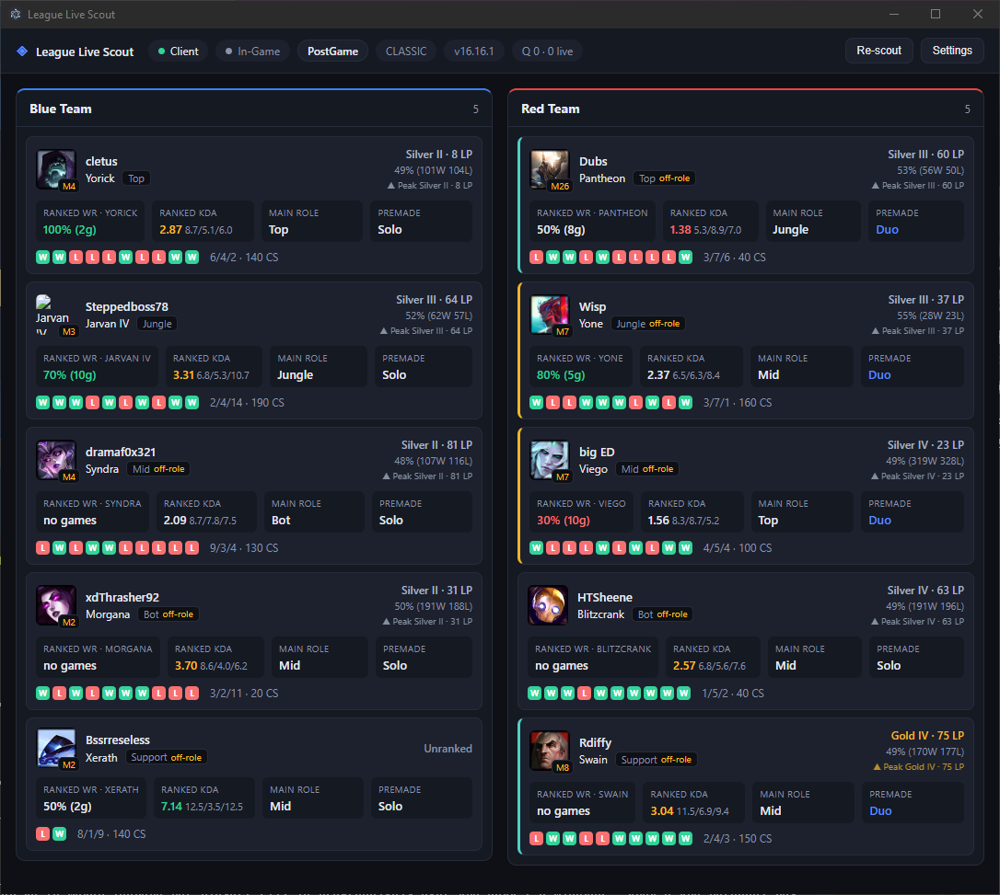

# League Live Scout

A desktop companion window for **League of Legends (NA)** that auto-detects your
game and scouts the **9 other players** using the official **Riot Games API** —
your own personal Porofessor / OP.GG-style pre-game intel.



When you enter champ select or a match, it loads every player and surfaces, per
champion picked:

- **Rank / tier / LP** and overall ranked win rate (solo/duo)
- **Win rate on the champion they're currently on** (from recent games)
- **Average KDA** over recent games
- **Current lane and main-role indicator** (with an off-role flag when they're
  out of position), the board ordered Top → Jungle → Mid → Bot → Support
- **Champion mastery** level & points (one-trick / experience signal)
- **Premade / duo detection** — who queued together vs. solo
- **Recent form** (W/L of the last games) and the **live scoreboard** in game

It runs as a standalone window to keep on a second monitor or alt-tab to — no
in-game overlay (that can be added later).

> Roles come from the game itself wherever possible (the Live Client reports an
> assigned lane for **both** teams) and from champ select for your own side.
> Where neither is available the role is inferred from summoner spells, champion
> tags and the player's most-played ranked role, and is marked with a `?` so a
> guess reads as a guess. Premade groups are always inferred.

## How it works

Three data sources feed a small state machine
(`Idle → ChampSelect → InGame → PostGame → Idle`):

1. **LCU API** (via `league-connect`, using the client's lockfile credentials) —
   drives the game-phase state machine and reads **your own** team's champ-select
   picks + assigned roles.
2. **Live Client Data API** (`https://127.0.0.1:2999/liveclientdata/allgamedata`,
   no auth) — available from the loading screen onward, this returns **all 10
   players** including the enemy team, their champions, summoner spells, assigned
   lanes, and the live scoreboard.
3. **Riot Games API** (personal key) — per player: `account-v1` → PUUID,
   `league-v4` → rank, `champion-mastery-v4` → mastery, and `match-v5` → recent
   games for champ win rate, KDA, main role, and premade detection.
   **Data Dragon** maps champion names ↔ ids and is cached per patch.

A cold game costs `10 players x (4 + 5 recent matches)` = **90 requests**: one
each for Riot ID, rank, mastery and the match-id list, plus one per sampled
match. Premades share cached match details, so real games land under that.

Riot enforces two budgets at once — an **app** limit shared by every endpoint and
a **method** limit per endpoint — and the queue tracks both, learning each from
`X-App-Rate-Limit` / `X-Method-Rate-Limit` on live responses rather than
hardcoding them. A method-scoped 429 backs off only that endpoint, so one
throttled fan-out no longer stalls the whole board.

All Riot API calls go through a **rate-limited queue**. It starts on the
conservative personal-key budget (20 req/s + 100 req/2 min) and then adopts
whatever `X-App-Rate-Limit` advertises, so a production key isn't throttled to
dev-key speed; 429s back off using `Retry-After`. Results land in a
**region-scoped TTL cache** so ordinary polling is free, while **Re-scout**
bypasses it and genuinely refetches.

## Setup

### 1. Get a personal Riot API key

1. Sign in at **https://developer.riotgames.com** with your Riot account.
2. Copy the **Development API Key** (starts with `RGAPI-`).
3. Open **Settings** in the app and paste it in. The key is stored **encrypted**
   at rest via your OS keychain (Electron `safeStorage` / Windows DPAPI); the
   renderer only ever sees a "key saved" boolean, never the key itself.

> ⚠️ Development keys **expire every 24 hours**. When scouting stops working,
> refresh the key on the portal and paste the new one. (For a permanent key you'd
> register a "Personal API Key" product on the portal — recommended for regular
> use.)

### 2. Install & run

```bash
npm install
npm run dev      # launch in development (hot reload)
```

To build and run the production bundle:

```bash
npm run build
npm run start
```

Then just **leave the window open** and start a game (bot game, normal, or
ranked). At champ select the app pre-warms your own team; at the loading screen
it pulls all 10 players and fills in stats progressively (cheap data first, then
match-derived stats). Your own card is marked with a **YOU** badge. The status
bar shows the request queue and an estimated countdown to a fully populated
board.

Region defaults to **NA** and can be changed in Settings; all live platforms are
listed. Note that `match-v5` and `account-v1` route differently for OCE, VN and
TW (match data lives on `sea`, which `account-v1` does not serve), which the
region table handles for you.

## Scripts

| Command             | What it does                                         |
| ------------------- | ---------------------------------------------------- |
| `npm run dev`       | Run the app with hot reload (electron-vite).         |
| `npm run build`     | Type-check, then build main/preload/renderer bundles.|
| `npm run start`     | Preview the production build.                        |
| `npm run typecheck` | Type-check node + web projects.                      |
| `npm test`          | Run the unit test suite (Vitest).                    |

## Project layout

```
src/
  shared/types.ts          Types + IPC channel names shared across processes
  main/
    index.ts               App bootstrap, window, IPC wiring
    lcu.ts                 league-connect wrapper + phase watcher
    liveClient.ts          Live Client Data poller (all 10 players)
    gameState.ts           State machine + enrichment orchestration
    settings.ts            Encrypted API key + prefs (electron-store + safeStorage)
    riot/
      client.ts            Typed Riot API endpoints
      rateLimiter.ts       Header-aware rate-limited request queue
      cache.ts             TTL cache with on-disk persistence
      ddragon.ts           Data Dragon champion lookup
      stats.ts             Pure match-derived stat functions
      roles.ts             Role assignment (exact lanes + scored inference)
      premades.ts          Premade/duo detection
  preload/index.ts         Typed IPC bridge (window.scout)
  renderer/                React UI (Zustand store, components)
test/                      Vitest unit tests + fixtures
```

## Testing

```bash
npm test
```

Covers stat derivation, the rate limiter (throttling + `Retry-After` backoff +
header reconciliation), premade detection, role assignment and scoreboard
ordering, Data Dragon resolution, the Live Client parser and merge rules, and
the TTL cache (including the Re-scout bypass) — all deterministic and offline
using recorded-shape fixtures.

**Live end-to-end:** launch the League client, enter a bot or normal game, and
confirm all 10 players load with stats while the request-queue readout in the
status bar stays within limits (and re-scouting hits the cache).

## Notes & limits

- **Localhost TLS:** the Live Client endpoint serves a self-signed Riot
  certificate; we use an unverified HTTPS agent **scoped strictly to
  `127.0.0.1:2999`** and nowhere else.
- **No scraping:** everything comes from official Riot endpoints. Respect the
  [Riot API developer policies](https://developer.riotgames.com/policies/general).
- **Approximate signals:** premade groups, and any role shown with a `?`, are
  inferred from spells / champion tags / ranked history / shared match history
  and can be wrong.
- **Summoner's Rift only:** lane assignment and off-role flags are skipped in
  modes without assigned lanes (ARAM, Arena), where they would be meaningless.

## License

Licensed under the **[PolyForm Noncommercial License 1.0.0](./LICENSE.md)** —
you're free to use, copy, modify, and share it for **any noncommercial purpose**
(personal use, hobby projects, learning, research). **Commercial use is not
permitted.** See [`LICENSE.md`](./LICENSE.md) for the full terms.

> This project isn't affiliated with or endorsed by Riot Games. League of Legends
> and Riot Games are trademarks or registered trademarks of Riot Games, Inc.
